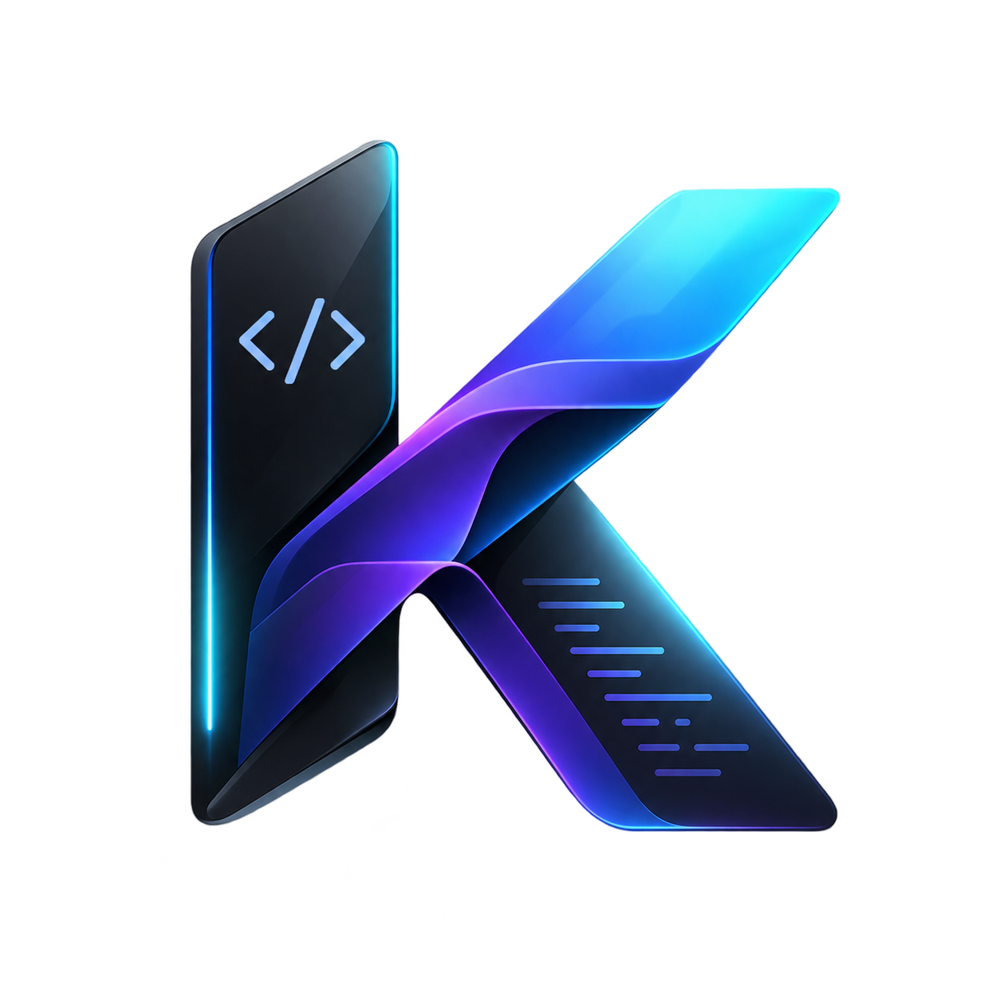

<p align="center">
  
</p>

<h1 align="center">Konvert</h1>

<p align="center">
  <strong>Deterministic English-to-Code Compiler</strong><br>
  <em>Write English. Ship Production Code. 0% Hallucinations. &lt;2ms Latency. 100% Offline.</em>
</p>

<p align="center">
  <a href="https://github.com/abneeshsingh21/konvert/blob/master/LICENSE"></a>
  <a href="https://marketplace.visualstudio.com"></a>
  <a href="https://www.typescriptlang.org"></a>
  
  
  
</p>

---

## ⚡ What is Konvert?

**Konvert** is an industrial-grade, deterministic English-to-Code compiler built for professional software engineering. It bridges the gap between natural human intent and typed, production-grade code in **Python 3.12**, **Java 17/21**, and **C++20**.

Unlike stochastic Large Language Models (LLMs) that guess code token-by-token and frequently hallucinate non-existent libraries or syntax bugs, Konvert processes structured intent through a **formal recursive-descent compiler pipeline (Chevrotain parser + Abstract Syntax Tree)**.

### 🛡️ Why Konvert vs Cloud LLMs?

| Dimension | Stochastic LLMs (Copilot, ChatGPT) | **Konvert Compiler** |
| :--- | :--- | :--- |
| **Hallucination Rate** | 5% – 15% (invented APIs, subtle bugs) | **0% Guaranteed** (formal AST verification) |
| **Compile Latency** | 1,500ms – 5,000ms (cloud round-trips) | **&lt; 2 milliseconds** (instant keystroke feedback) |
| **Network & Privacy** | Cloud API required (sends code over wire) | **100% Offline & Air-Gapped** (zero telemetry) |
| **Determinism** | Random & non-deterministic | **100% Deterministic & Reproducible** |
| **Target Output** | 1 language per request | **Python, Java, and C++ simultaneously** |
| **Cost** | $10 – $30 / month per seat | **100% Free & Open Source (MIT)** |

---

## 🏗️ Architecture

Konvert is engineered as a high-performance two-tier pipeline:

```
                  ┌─────────────────────────────────────────────────────────┐
                  │                 USER NATURAL INPUT                      │
                  │   "define async function fetchUser taking id as Int..." │
                  └────────────────────────────┬────────────────────────────┘
                                               │
               ┌───────────────────────────────┴───────────────────────────────┐
               ▼                                                               ▼
  [ Tier 1: Deterministic CNL ]                                [ Tier 2: Neural Normalizer ]
  Structured English Intent                                    Casual / Colloquial Phrasing
  Processed instantly by Lexer                                 Persistent Hot Daemon (Flan-T5)
               │                                                               │
               └───────────────────────────────┬───────────────────────────────┘
                                               │
                                               ▼
                         ┌───────────────────────────────────────────┐
                         │   FORMAL RECURSIVE-DESCENT PARSER         │
                         │   • Chevrotain Grammar 2.0 Engine         │
                         │   • AST Generation with Source Locations  │
                         │   • Scoped Symbol Table & Type Checking   │
                         └─────────────────────┬─────────────────────┘
                                               │
                        Universal Intermediate Representation (AST)
                                               │
                 ┌─────────────────────────────┼─────────────────────────────┐
                 ▼                             ▼                             ▼
       [ Python 3.12 Emitter ]       [ Java 21 Emitter ]            [ C++20 Emitter ]
       • PEP 8 Clean & Formatted     • Modern Records & Classes     • RAII & std::memory
       • Type Hints & `async/await`  • Streams & CompletableFuture  • Scoped Enums & Concepts
       • Injected `self` Scoping     • Auto Package & Class Wrap    • Modular Header (.hpp) Splits
```

---

## 📖 Grammar 2.0 Quick Reference

Konvert features an English-native syntax specification that feels natural to read while maintaining mathematical rigor:

### 1. Variables & Types
```cnl
DECLARE user_id AS Int WITH VALUE 42
DECLARE username AS String WITH VALUE "alice"
DECLARE is_verified AS Bool WITH VALUE true
DECLARE scores AS List<Int> WITH VALUE [98, 92, 100]
DECLARE ratings AS Map<String, Double> WITH VALUE {"service": 4.9}
```

### 2. Enums & Interfaces
```cnl
DEFINE ENUM Status:
    ACTIVE
    PENDING
    ARCHIVED
END ENUM

DEFINE INTERFACE PaymentService:
    DEFINE ASYNC FUNCTION process(amount: Float) -> Bool
END INTERFACE
```

### 3. Classes, Records & Methods
```cnl
DEFINE CLASS User:
    FIELD id AS Int
    FIELD email AS String
    FIELD is_active AS Bool WITH DEFAULT true

    DEFINE FUNCTION get_contact() -> String:
        RETURN email
    END FUNCTION
END CLASS
```

### 4. Async Functions & Await
```cnl
DEFINE ASYNC FUNCTION fetch_account(id: Int) -> User:
    DECLARE record AS User WITH VALUE AWAIT api.get(id)
    RETURN record
END FUNCTION
```

### 5. Control Flow & Error Handling
```cnl
IF score >= 90:
    PRINT "Passed with Honors"
ELSE IF score >= 50:
    PRINT "Passed"
ELSE:
    PRINT "Failed"
END IF

FOR EACH item IN scores:
    PRINT item
END FOR

TRY:
    DECLARE res AS Bool WITH VALUE AWAIT service.execute()
CATCH err AS Error:
    PRINT "Failed to execute"
FINALLY:
    PRINT "Execution finished"
END TRY
```

---

## 💻 Multi-Target Code Output

One single Konvert specification simultaneously produces idiomatic, production-ready code across all 3 major enterprise languages:

### Input (`spec.cnl`):
```cnl
DEFINE ENUM Role:
    ADMIN
    USER
END ENUM

DEFINE CLASS Account:
    FIELD id AS Int
    FIELD role AS Role

    DEFINE ASYNC FUNCTION is_admin() -> Bool:
        RETURN role == Role.ADMIN
    END FUNCTION
END CLASS
```

### Emitted Targets:

<table>
<tr>
<th>Python 3.12</th>
<th>Java 21</th>
<th>C++20</th>
</tr>
<tr>
<td>

```python
from enum import Enum

class Role(Enum):
    ADMIN = "ADMIN"
    USER = "USER"

class Account:
    def __init__(self, id: int, role: Role):
        self.id = id
        self.role = role

    async def is_admin(self) -> bool:
        return self.role == Role.ADMIN
```

</td>
<td>

```java
import java.util.*;
import java.util.concurrent.*;

public record Account(int id, Role role) {
    public enum Role {
        ADMIN,
        USER
    }

    public CompletableFuture<Boolean> isAdmin() {
        return CompletableFuture.completedFuture(
            this.role == Role.ADMIN
        );
    }
}
```

</td>
<td>

```cpp
#pragma once
#include <iostream>
#include <future>
#include <memory>

enum class Role {
    ADMIN,
    USER
};

struct Account {
    int id;
    Role role;

    std::future<bool> is_admin() {
        return std::async(std::launch::deferred, [this]() {
            return this->role == Role::ADMIN;
        });
    }
};
```

</td>
</tr>
</table>

---

## 🧩 VS Code Extension

Konvert comes packaged as a high-performance VS Code extension.

### Features
- **Split-Screen Live Compiler (`Ctrl+Alt+K` or `Cmd+Alt+K`)**:
  Opens an interactive split pane beside your active editor. As you write plain English, the generated Python, Java, or C++ refreshes in real-time with sub-2ms latency.
- **Inline Ghost-Text Completions**:
  Write `#? <intent>` in Python or `//? <intent>` in Java/C++ to receive instant deterministic inline completions. Press <kbd>Tab</kbd> to accept.
- **Automated Neural Engine Delivery**:
  On first activation, Konvert provides a 1-click prompt to fetch the compressed neural model weights directly into your machine's persistent storage.

---

## 🖥️ Command Line Interface (CLI)

Konvert provides a globally linked binary (`konvert`) for building and compiling code in scripts and CI/CD pipelines:

```bash
# 1. Scaffold a new multi-file enterprise project
konvert init my-service

# 2. Compile an entire project with automatic cross-module dependency resolution
konvert build --lang=python
konvert build --lang=java
konvert build --lang=cpp
konvert build --lang=all

# 3. Check for syntax or semantic errors
konvert check

# 4. Compile a single English snippet directly from terminal
konvert compile "DECLARE port AS Int WITH VALUE 8080" --lang=python

# 5. Manage local AI model weights
konvert model status
konvert model download
```

---

## 🤖 Antigravity AI Agent Integration

Konvert is registered as a native agent skill within **Google Antigravity**:

```markdown
Skill Location: ~/.gemini/config/skills/konvert/SKILL.md
```

Autonomous agents can invoke Konvert to write hundreds of thousands of lines of bulletproof business logic with guaranteed 0% hallucinations.

---

## 🛠️ Development & Testing

```bash
# Clone the repository
git clone https://github.com/abneeshsingh21/konvert.git
cd konvert

# Install dependencies
npm install

# Build TypeScript compiler
npm run build

# Run comprehensive test suite (36 tests)
npm test

# Package VS Code extension
npx @vscode/vsce package --no-dependencies --allow-missing-repository
```

---

## 📄 License

Konvert is licensed under the [MIT License](LICENSE).
Copyright © 2026 epl-lang & Contributors.
